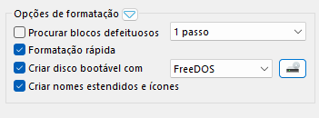
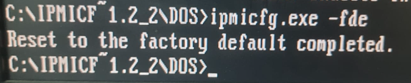
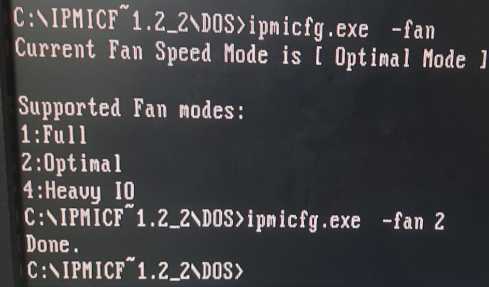

# Reset_IPMI-password_server_supermicro

Resetando a senha IPMI no Servidor Supermicro.

*1° - Criando sistema.*

Utilize algum sistema Live para boot no servidor.

Você pode gravar o FreeDOS em um pendriver utilizando o próprio Rufus.



Após gravação do FreeBSD, jogue os arquivos do utilitário IPMI CFG na raiz do pendriver.

IPMI CFG SuperMicro: https://www.supermicro.com/SwDownload/SwSelect_Free.aspx

*OBS: Se a Firmware do Servidor for antigo, utilize a primeira versão do IPMI_CFG.*

Releases IPMI CFG:https://www.supermicro.com/wdl/utility/IPMICFG/Previous%20Releases/

*2º - Configurando o Servidor*

Acesse o menu de boot com F11 e inicie o Pendriver para iniciar o FreeDOS.

no terminal, use *cd /DOS* para entrar na pasta DOS.


Redefina o IPMI para default. 
```
ipmicfg –fde
```

Espere por 1 minuto e desligue os cabos de energia. O IPMI irá ser restaurado para os padrões de fábrica.


----------------------------------------------------------

Para verificar a rede:
```
ipmicfg –m
```

Configurar Rede:
Para verificar a rede:
```
ipmicfg –m IP
ipmicfg -k MAC
```



Também é possível efetuar o reset utilizando outros S.O Live, exemplo: Linux, Windows Live, você pode utilizar alguma .Iso do Hiren's Boot ou DLC Boot...

LINUX:
baixe os pacotes de *ipmitool*.

```
Pacotes:

sudo apt update && sudo apt install ipmitool  # Debian/Ubuntu
sudo yum install ipmitool  # CentOS/RHEL
sudo dnf install ipmitool  # Fedora

Verifique o IPMI:

ipmitool lan print

ipmitool -I lanplus -H <IP_DO_IPMI> -U <USUÁRIO> -P <SENHA> mc chassis status

Acesse o IPMI para Reset:

ipmitool -I lanplus -H <IP_DO_IPMI> -U <USUÁRIO> -P <SENHA> mc reset cold

Verifique:

ipmitool mc info


```

Windows:

```
cd URL\ipmicfg\

ipmicfg -r  # Reset conf IPMI
ipmicfg -fd # Reset total

```


**FAN 100% Supermicro**

```
ipmicfg.exe -fan

```



